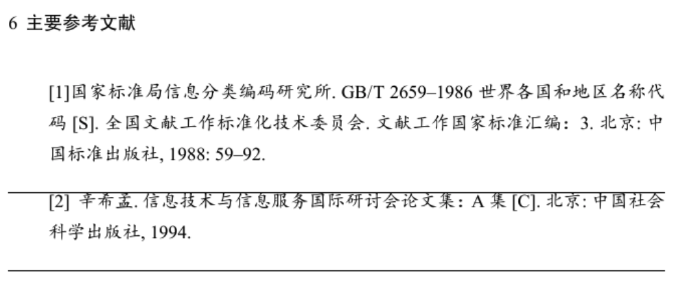
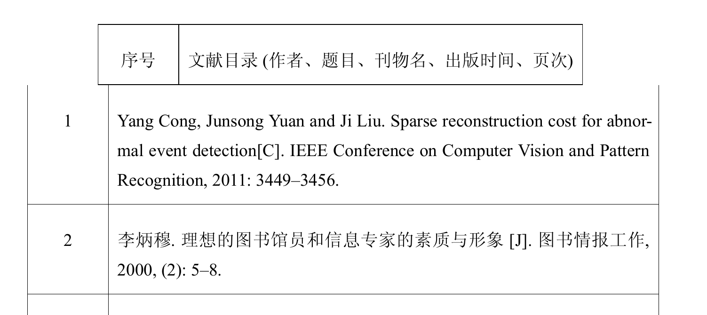
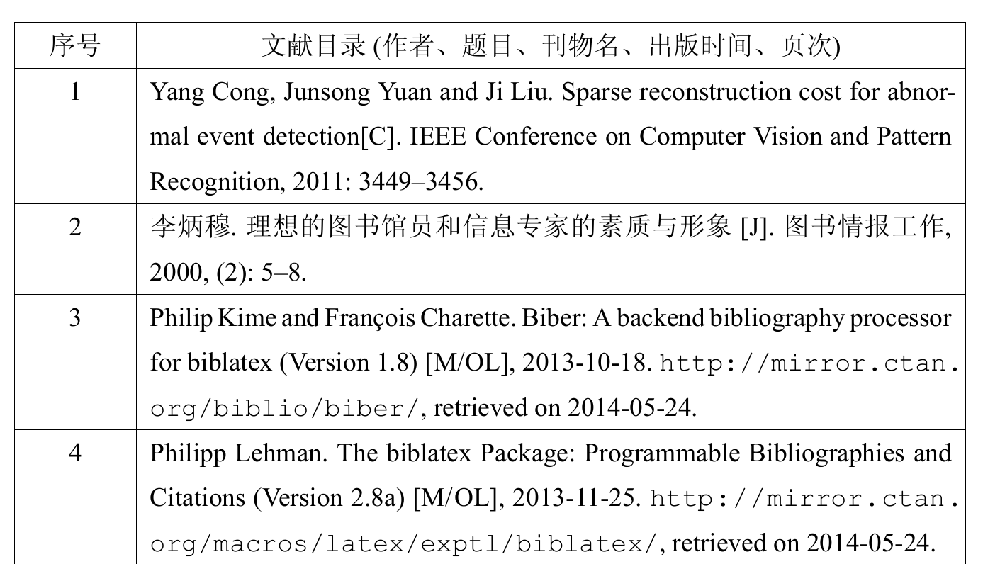

# NUDT硕士博士研究生开题报告latex模板说明

# 前言

fork from TomHeaven/nudtproposal [NUDT proposal](https://github.com/TomHeaven/nudtproposal)

reference在我的机器上运行存在一些问题

BUG如下：（\enabletablebib{yes}后编译结果如下）


故进行了部分调整，但是原project中的reference的BUG仍然存在🤦‍♂️
差强人意，勉强能用。
注意用法->首页设定中BUG 的临时解决方案，进行了调整。

希望有大神能解决这个BUG

除此之外，我在使用时还遇到一些情况，可能和我的环境相关，解决方法仅供参考：（不算bug，和各老师要求的格式相关）

1、首行缩进问题

我使用时，如果在每一个section里，不加subsection，直接开始写内容，就会出现无法首行缩进的问题，直接手动在内容前加个缩进`\qquad`

2、字体问题

我使用时，正文不是楷体，在`\begin{mdframed}[everyline=true]`下面加`\kaishu`

3、题目问题

题目默认是两行，但是我的开题题目不需要两行，这时候修改一下cls文件，将原本的下面的一部分：

```
    \begin{tabular}{lc}
      \NUDT@label@title &  {\mdseries\fangsong \NUDTunderline[295pt]{\NUDT@value@title}} \\  &  {\mdseries\fangsong \NUDTunderline[295pt]{\NUDT@value@sectitle}}  \\
      { \NUDT@label@authorid} & \NUDTunderline[113pt]{ \zihao{-3}\mdseries\fangsong \NUDT@value@authorid}\NUDT@label@author\NUDTunderline[113pt]{\mdseries\fangsong  \NUDT@value@author}
    \\
       \NUDT@label@major &  \NUDTunderline[295pt]{\mdseries\fangsong \NUDT@value@major}
     \\
         \NUDT@label@field &  \NUDTunderline[295pt]{\mdseries\fangsong  \NUDT@value@field}
     \\
      \NUDT@label@advisor & \NUDTunderline[113pt]{\mdseries\fangsong  \NUDT@value@advisor}\NUDT@label@advisortitle\NUDTunderline[113pt]{\mdseries\fangsong  \NUDT@value@advisortitle}
    \\
      \NUDT@label@institute & \NUDTunderline[295pt]{\mdseries\fangsong  \NUDT@value@institute}
    \\
      \NUDT@label@date & \NUDTunderline[295pt]{\mdseries\fangsong  \NUDT@value@chinesedate}
    \end{tabular}
```

修改为：

```
\begin{tabular}{lc}
	\NUDT@label@title &  {\mdseries\fangsong \NUDTunderline[295pt]{\NUDT@value@title}}  \\
	{ \NUDT@label@authorid} & \NUDTunderline[113pt]{ \zihao{-3}\mdseries\fangsong \NUDT@value@authorid}\NUDT@label@author\NUDTunderline[113pt]{\mdseries\fangsong  \NUDT@value@author}
	\\
	\NUDT@label@major &  \NUDTunderline[295pt]{\mdseries\fangsong \NUDT@value@major}
	\\
	\NUDT@label@field &  \NUDTunderline[295pt]{\mdseries\fangsong  \NUDT@value@field}
	\\
	\NUDT@label@advisor & \NUDTunderline[113pt]{\mdseries\fangsong  \NUDT@value@advisor}\NUDT@label@advisortitle\NUDTunderline[113pt]{\mdseries\fangsong  \NUDT@value@advisortitle}
	\\
	\NUDT@label@institute & \NUDTunderline[295pt]{\mdseries\fangsong  \NUDT@value@institute}
	\\
	\NUDT@label@date & \NUDTunderline[295pt]{\mdseries\fangsong  \NUDT@value@chinesedate}
\end{tabular}
```

之后在设置题目时，第二个参数空着就好：
`\nudttitle{你的题目}{}`

# 用法

## 首页设定

nudtProposal.tex 中的注释已有详细说明：
```
%%%%% --------------提示：修改本节内容用于设置文档，请仔细阅读---------------------
%% 
%% 编译环境：texlive-2015。
%% 推荐IDE：texstudio（WinXXX 太挫了）。
%% 编译选项：tex 编译器选择 xelatex，参考文献编译器选择 biber（不能用bibtex）！
%% 以上环境配置经过作者测试，确定可以正常使用。

%%%%% ---------------提示：本参数提供一个参考文献格式 BUG 的临时解决方案------------
% 是否将参考文献放入表格。这个选项的设置因为参考文献格式有一个暂时无解的 BUG。设置为 yes 之前，
% 必须先设置为 no 编译一次。否则正文中引用数字都是 0。
% 最终提交前将此参数改为 yes 编译一次。注意：设置为yes后编译第二次就会出现正文中引用数字都是 0 的 BUG!
% 如果设置为 yes 后，还需要修改正文，那么改为 no，编译两次参考文献才会正常!
\enabletablebib{no}   % 最终提交前将此参数改为 yes 编译两次! 如需修改正文，改为 no 后编译两次参考文献才会正常!
```
**注意！！！！！！！！！**

经过我修改后，这个BUG进化了🤦‍♂️
修改成为yes后，第一次编译会出现以下结果，表头并不对齐，这时不要慌


再次编译后就会正常：


我也不知道为啥，但是能用了，希望后续有大神能帮忙解决这个BUG
```
%% 以下参数用于设置文档首页和页眉信息
\proposaltype{doctor}          % 研究生类别：硕士设置为 master，博士设置为 doctor
\enabletableofcontents{no}   % 是否生成目录：如果需要目录设置为 yes，否则设置为 no。我校开题报告默认没有目录
\proposalnumber{\underline{\hbox to 10mm{}}}          % 编号：默认是下划线，评议版请设为评议版，修订版设为真实编号
\classification{公开}              % 密级：公开，秘密，机密或者绝密
\nudttitle{国防科技大学开题报告}{\LaTeX{} 模板} % 因 title 一般都很长需要两行，第一参数为第一行内容，第二个参数为第二行内容
\author{谭同学}                    % 作者
\authorid{160590xx}            % 学号
\advisor{张老师}                   % 导师
\advisortitle{教~~~~授}         % 职称
\degreetype{工学}                 % 学位类别
\major{控制科学与工程}          % 一级学科
\field{图像处理}                      % 研究方向
\institute{信息系统与管理学院}% 学院
\chinesedate{2018~年~03~月~23日} % 开题日期
\formdate{二零一八年一月}     % 制表月份 注意：用“〇”可能会出现字体不显示的问题，所以这里改为了“零”
```

## 图表插入

由于开题报告放在表里（mdframed），浮动格式 figure 和 table 都不能用了。作者提供了替代方案：
```
%% ----------------注意： mdframed 中不能使用 figure 和 table。用以下示例方法替代。----------------
\begin{center}
	\includegraphics[width=0.7\linewidth]{Img/fig1}
	\captionof{figure}{人群四散逃离的异常事件（全局异常事件）} % \caption{} 改为 \captionof{figure}{}
	\label{fig:fig1}
\end{center}

\begin{center}
	\includegraphics[width=0.7\linewidth]{Img/fig2}
	\captionof{figure}{摩托车违章逆行的异常事件（局部异常事件）} % \caption{} 改为 \captionof{figure}{}
	\label{fig:fig2}
\end{center}


\begin{center}
	\captionof{table}{一张表}   % \caption{} 改为 \captionof{table}{}
	\begin{tabular}{lrrr} \hline
		年份        & 乡村 & 城市 & 所有   \\ \hline
		1983        & 38.7  & 55.6  & 44.7  \\
		1993–1994   & 50.3  & 66.4  & 54.3  \\
		2004–2005   & 50.2  & 69.3  & 55    \\
		2009–2010   & 51.7  & 71.6  & 57.1  \\ \hline
		\multicolumn{4}{@{}l@{}}{\footnotesize 来源: http://tomheaven.cn} 
	\end{tabular}
    \label{tab:tab1}
\end{center}
```
以上方案可以产生与 figure 和 table 同样的效果，只是不能浮动。

# Texlive 的安装方法

- Texlive 官网：<https://www.tug.org/texlive/acquire-netinstall.html>
- Windows 安装程序（在线）：<http://mirror.ctan.org/systems/texlive/tlnet/install-tl-windows.exe>
- Ubuntu 可以直接安装：`sudo apt-get install texlive-full`
- macOS 安装方法：<http://www.tug.org/mactex/>

注意，一些 Windows 旧版本的 MiKTex 不带 biber，无法编译参考文献，请更新为最新版本的 texlive。

# FAQ

## 1. 有时候参考文献不能及时更新的解决方案

作者在使用中发现个别时候 texstudio 并不能自动检测到参考文献更新了，故而提供一种手动更新参考文献的方法：执行“工具”->“编译”（快捷键F6）；执行“工具”->“命令”->“biber”（可以在选项中设置这个命令的快捷键为 F4）；再次执行编译。这样参考文献就手动更新了。


## 2. 安装依赖的字体

从以下链接中下载ttf.zip，并逐个安装： 
https://github.com/TomHeaven/nudt_thesis/releases/tag/v1.1

## 3. 编译时报错bbl文件中找不到citation
确认texstudio中参考文献编译器设置为`biber`，而非`bibtex`。


# 免责声明

本模板免费提供于同学们使用或修改，但 is provided "As IS"。使用本模板产生的任何问题作者不承担任何直接或者间接责任。但作者会尽力帮助有需要的同学解决问题。

作者也会尽力维护模板，但是毕竟能力时间有限，盼望同学们一起来完善模板。

Contact: hanlin_tan@nudt.edu.cn
